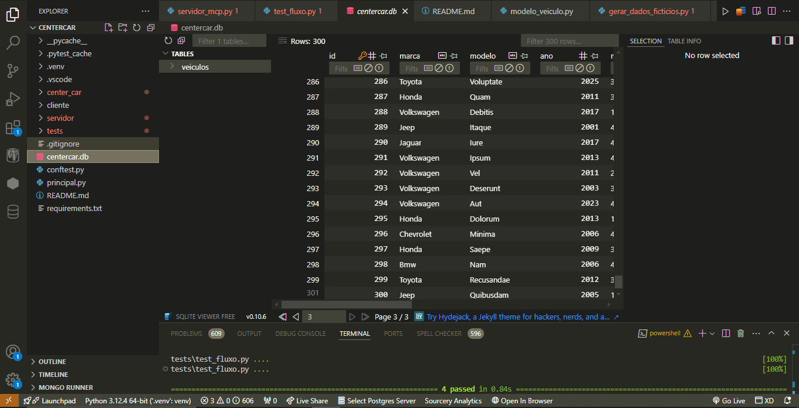

                                          # Center Car   
                                          ______________
                                  _______/[] [] [] [] []\_______
                                 |______________________________|
                                    Oo                        oO

Buscador de veículos no terminal, feito para mostrar reconhecimento em Python, uso de boas libs e um design simples, mas funcional. 

Você conversa com um “agente” que faz perguntas soltas, o cliente envia filtros para o servidor via
**“protocolo MCP” minimalista** (envelope `{ "tool": "search_cars", "args": {...} }`) e recebe de volta
`{"ok": true, "result": [...]}`. Mantive **modo legado**: se algum cliente antigo mandar só os filtros
(direto), o servidor ainda aceita.

## O que tem aqui!?!

* Modelagem de dados com SQLAlchemy: classe `Veiculo` com 10 atributos (marca, modelo, ano, motorização, tipo de combustível, cor, km, portas, transmissão e preço).
* Script de geração de dados falsos (`Faker`): popula o banco com 100 veículos variados. *(e no uso abaixo eu populo +200 depois, total 300 )*
* Servidor TCP que implementa MCP: **envelope `tool/args`**, consulta e devolve **`ok/result`** (com compatibilidade legado).
* Cliente + agente de terminal: você digita respostas soltas, o bot monta os filtros e mostra os achados de forma amigável. *(o agente também aceita variações de combustível: “hibrido” → `Flex`, “eletrico” → `Elétrico` etc.)*
* Testes com `pytest` para garantir filtros, protocolo e exibição do agente.

                                                    ## Pré-requisitos

* Python 3.8 ou superior instalado.
* (Opcional) Git para clonar o repositório.
* Terminal/bash/Powershell para rodar comandos.

## Como rodar.

1. Entre na pasta do projeto:

   cd CenterCar
   

2. Crie e ative um ambiente virtual:

   python3 -m venv .venv
    .venv/bin/activate

   # Windows (PowerShell)
   .\.venv\Scripts\Activate
   

3. Instale as dependências:

   *pip install -r requirements.txt*

4. Crie o banco e as tabelas:

   *python -c "from center_car.banco_dados import criar_banco; criar_banco()"*
   

   Isso vai gerar o arquivo `centercar.db` na raiz. 
   (Usei uma extensão do Sqlite dentro do VsCode do camarada, Florian Klamper - SQLite Viewer, mostra a tabela legal na IDE.)

   <p align="center">
    
   </p>

5. Populei com 300 veículos (100 + 200) fake:

   *python -m center_car.gerar_dados_ficticios*
   
  Se você vir a mensagem, `100(200) veículos inseridos com sucesso!`  
  *então foi!....*


6. inicie o servidor MCP:

   *python -m servidor.servidor_mcp*

   Ele vai rodar em `127.0.0.1:5000` padrão. 
   Se quiser mudar, edita lá no `center_car/config.py` (HOST/PORTA).  
   *(O servidor agora lê HOST/PORTA do `config.py`; sem duplicação.)*

7. Em outro terminal, execute o agente de terminal:

   *python -m cliente.agente_terminal*


# Siga o papo: 
digite marca, modelo, ano, combustível, preço — tudo opcional, pode pular apertando Enter. 
O bot vai mandar os filtros pro servidor e te mostrar os carros encontrados.


## Exemplo de sessão

=== CenterCar ===

Olá! Eu sou o CenterCar Bot e vou te ajudar a encontrar veículos.
Você pode pular qualquer pergunta apertando Enter.

*Qual marca você procura?* Jeep
*E qual modelo (ou parte do nome)?* 
*Ano mínimo (ex: 2010)?* 2020
*Ano máximo (ex: 2023)?* 
*Que tipo de combustível?* Etanol
*Preço máximo (somente números)?* 

*Buscando veículos...*
  👍 *Encontrei 2 veículo(s):*

 *• Jeep Eligendi (2021) – Azul cobalto, 110114.81 km, R$ 221320.0*
 *• Jeep Facilis (2023) – Azul céu, 145206.62 km, R$ 294472.99*


* *Quer dar uma olhada em todos os nossos carros cadastrados? Olha que vale a pena hein!... (s/N)* n   

* *Deseja fazer outra consulta com a gente? Vai ser rapidinho... (s/N)* n

*Obrigado por usar o CenterCar. Até a próxima!*


## Protocolo MCP (contrato simplificado)

**Transporte:** Socket TCP com framing: `4 bytes (big-endian)` do tamanho + `JSON UTF-8`.

**Requisição (envelope):**
```json
{"tool":"search_cars","args":{"marca":"Jeep","modelo":"Ren","ano_min":2020,"preco_max":120000}}
````

**Resposta (OK):**

```json
{"ok":true,"result":[{"id":1,"marca":"Jeep","modelo":"Renegade","ano":2021,"tipo_combustivel":"Etanol","cor":"Azul","quilometragem":12345.6,"numero_portas":4,"transmissao":"Automático","preco":98765.43}]}
```

**Resposta (Erro):**

```json
{"ok":false,"error":{"code":"INVALID_REQUEST","message":"Envelope deve conter 'tool' e 'args'"}}
```

Códigos de erro: `INVALID_HEADER`, `INVALID_JSON`, `INVALID_REQUEST`, `UNKNOWN_TOOL`, `SERVER_ERROR`
Detalhado em: `docs/protocolo-mcp.md` + schemas: `docs/schemas/request.json` e `docs/schemas/response.json`.

**Compatibilidade:** se um cliente legado mandar **só os filtros** (sem `tool/args`), o servidor responde com **lista simples** (sem `ok/result`).

## Testes

Temos **3** suítes principais:

* `tests/test_fluxo.py` — filtros e comunicação básica.
* `tests/test_agente.py` — **formatação das respostas do agente** e fluxo de coleta.
* `tests/test_protocolo.py` — **envelope MCP** (`tool/args`) e erros de contrato.

Roda assim:

*pytest --disable-warnings -q*

Se passar sem erros, tudo verdinho?!, tá tranquilo. rsrs

## Estrutura do projeto

CenterCar/
├── center\_car/
│   ├── banco\_dados.py           <- conexão e criação de tabelas
│   ├── config.py                <- host, porta e caminho do DB (fonte única)
│   ├── gerar\_dados\_ficticios.py <- script com Faker para popular DB
│   └── modelo\_veiculo.py        <- modelo SQLAlchemy do Veiculo
│
├── servidor/
│   └── servidor\_mcp.py          <- servidor TCP + filtro em SQLAlchemy (MCP envelope + legado)
│
├── cliente/
│   ├── cliente\_mcp.py           <- lógica de socket + JSON (envelope MCP com fallback)
│   └── agente\_terminal.py       <- interface “conversa solta” no terminal
│
├── docs/
│   ├── protocolo-mcp.md         <- contrato explicado
│   └── schemas/
│       ├── request.json
│       └── response.json
│
├── tests/
│   ├── test\_fluxo.py
│   ├── test\_agente.py
│   └── test\_protocolo.py
│
├── centercar.db                 <- banco SQLite (não comitar)
├── principal.py                 <- script unificado (servidor/cliente/tudo)
├── README.md
└── requirements.txt

## deu vontade de fazer!

*painel web minimalista - 'Tkinter' talvez... rsrs*


**# **Mas tá aí, muito obrigado pela oportunidade e espero que gostem.** #**

## ***© 2025 Moa Fernandes. All rights reserved.***


